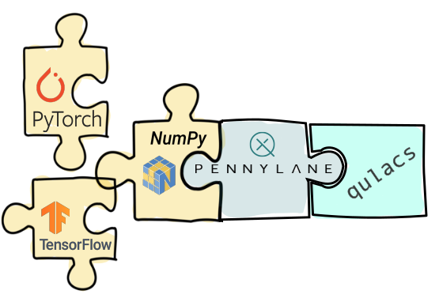

PennyLane-Qulacs Plugin
#######################

:Release: |release|

|

.. include:: ../README.rst
  :start-after:	header-start-inclusion-marker-do-not-remove
  :end-before: header-end-inclusion-marker-do-not-remove

Once Pennylane-Qulacs is installed, the provided Qulacs devices can be accessed straight
away in PennyLane, without the need to import any additional packages.

Devices
~~~~~~~

Currently, PennyLane-Qulacs provides one Qulacs device for PennyLane:

.. devicegalleryitem::
    :name: 'qulacs.simulator'
    :description: Qulacs's simulator backend.
    :link: devices/simulator.html
 
.. raw:: html

        

         

Tutorials
~~~~~~~~~

To see the PennyLane-Cirq plugin in action, you can use any of the qubit based `demos
from the PennyLane documentation <https://pennylane.ai/qml/demonstrations.html>`_, for example
the tutorial on `qubit rotation <https://pennylane.ai/qml/demos/tutorial_qubit_rotation.html>`_,
and simply replace ``'default.qubit'`` with the ``'qulacs.simulator'`` device:

.. code-block:: python

    dev = qml.device('qulacs.simulator', wires=XXX)

.. toctree::
   :maxdepth: 2
   :titlesonly:
   :hidden:

   installation
   support

.. toctree::
   :maxdepth: 2
   :caption: Usage
   :hidden:

   devices/simulator

.. toctree::
   :maxdepth: 1
   :caption: API
   :hidden:

   code
